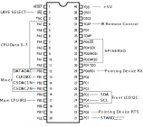

# Slave Controller

## Pinout

## Memory Map

$0050 RAM Start
$0100 ROM Start
$1FF4 User Vectors

## IRQ Vectors

$1ffe -> $100  Reset
$1ffc -> $100  SWI
$1ffa -> $32f  External IRQ
$1ff8 -> $961  Timer
$1ff6 -> $67a  SCI
$1ff4 -> $100  SPI

## Timer

The internal CPU clock is fOSC/2
The 16 bit timer counter is /4 of that.
fOSC is 4 MHz.
This means the counter operates at 0.5 MHz.
Ever clock is 2µs

clk_sys is 30 MHz
Because of clken, fOSC is 15 MHz

A division by 30 would be required.

## Infrared Input

The [RC5 protocol](https://www.opendcc.de/info/rc5/rc5.html) is used.
According to this source, the modulation frequency would be 36 kHz.
According to the service manual of the CDI 210/05, the GP1U52X Ir receiver is used.
According to the datasheet of this receiver, the modulation frequency is 40 kHz.
The transmitting diode inside the Thumbstick Controller 22ER9051 (also known as RV 6701/00) is unknown.
Using a photo diode, I've measured the actual frequency, which occured to be 36 kHz.
So a possible receiver circuit should be based on that.

For some reason, the "Philips_CDI_220_(00)_Service_Manual" claims that a GPU521X is used.
This part doesn't exist but The GP1U521X does and uses 38 kHz.
It should be noted that [RC-6](https://www.sbprojects.net/knowledge/ir/rc6.php) also exists
which a according to this website also uses 36 kHz.

## Observations

### Timing when asking for Region

A real SLAVE 3.2 inside a CDI 210/05 performs a I2C transaction to the front display every 8.1ms
It seems this is exactly the timer IRQ for the output compare and thus the time base of the SLAVE.

CPU and SLAVE have their reset signal lifted at the exact same time.
A real CDI 210/05 will have the M68K ask for PAL/NTSC region and then poll for the result.
The result is available after 152 pollings on a real machine which takes 196ms in total.
The polling has a period of 1.3ms.
The operation will time out after 500 pollings. The default is NTSC when this happens.

### Play button via RC5 Remote Control

On SLAVE 2.0 there is not much

    Read SLAVE 01 0404 1 0 0

On SLAVE 3.2 there is much more

    Read Slave
    ff ff ff ff CH0
    a2 04 ff ff CH1 (The A2 is missing on SLAVE2.0)
    ff ff ff ff CH2
    04 ff ff ff CH3

### Play button on front panel

With SLAVE 3.2

    a1 87 20 ff

With SLAVE 2.0

    87 20 ff  (Notice the missing A1)

## PAL/NTSC responses on F6

    PAL  f6 02
    NTSC f6 01

## Variables
    0050 Multiplied with Attenuation value?
    0053 Bit 4 activates transmission to DAC
         Only when set, jump to 0aa6 is performed during main loop at 02ba
         Bit 4 is set by Mute Command at 0x0575
         Bit 4 is set by Unmute command at 0x575 as well
         Bit 4 is cleared after the transmission was performed in function 0afe
         Bit 4 is set at 0x0561 which seems to be related to timing. When?
         Bit 4 is set at 0x0589. When? Seems to be near
               to 0x575 when a compare went different.
         Bit 0 is set when new data from Ir
    0056 Bit 0 is cleared on Unmute
         Bit 0 is set on Mute
    0059 Checked on Unmute
    0063 Bit 4 set on channel 0 83?
    0064 Timer High (ACHR) is stored here at 0571
         Written after Unmute but not always. There is a 
         comparsion involved between ACHR and 0x0064. Fading?
    0066 SERVO SPI Byte 0
    0067 SERVO SPI Byte 1
    0068 SERVO SPI Byte 2
    0069 SERVO SPI Byte 3
    0075 Attenuation Highest Bit?
    0076 Attenuation 0
    0077 Attenuation 1
    0078 Attenuation 2
    0079 Attenuation 3
    0099 Copy of 0x0066 (during 0c3d)
    009a Copy of 0x0067 (during 0c3d)
    009b Copy of 0x0068 (during 0c3d)
    009c Copy of 0x0069 (during 0c3d)
    009e Ir RC Shift Register 0
    009f Ir RC Shift Register 1
    00a0 Ir RC Shift Register 2
    00a1 Ir RC Shift Register 3
    00a2 Ir Rc Storage 0
    00a3 Ir Rc Storage 1
    00a4 Ir Rc Storage 2
    00a5 Ir Rc Storage 3
    00a6 Counter for Ir
    00d1 Only written at 0ff0. Always incremented by 0x10
    00da Only written at 0160
    00db Probably End of Stack
    00ff Start of Stack
    0b37 Array of Attenuation values. Only 0x2d entries

## Functions

    032f        IRQ Routine when called from CPU
    0abf - 0afd Transfers all attenuation values
    0afe - 0b36 Transmits 8 bit to DAC
    0bde - 0ce8 Analysis of SERVO SPI

## Commands

    move.b #$82,$310004 ; Mute
    move.b #$83,$310004 ; Unmute

## Communication at bootup with mame and cdi200.rom

    zx405037p__cdi_servo_2.1__b43t__llek9215.mc68hc705c8a_withtestrom.7201 ROM NEEDS REDUMP
    zx405042p__cdi_slave_2.0__b43t__zzmk9213.mc68hc705c8a_withtestrom.7206 ROM NEEDS REDUMP
    WARNING: the machine might not run correctly.
    [:lcd] :lcd: Deprecated legacy Old Style screen configured (set_vblank_time), please use set_raw instead.
    Soft reset
    [:slave_hle] slave_w: Channel 0: 0 = 86
    [:slave_hle] slave_w: Channel 0: 0 = 89
    [:slave_hle] slave_w: Channel 3: 0 = 80
    [:slave_hle] slave_w: Channel 3: 0 = 60
    [:slave_hle] slave_w: Channel 3: 0 = 73
    [:slave_hle] slave_w: Channel 3: 0 = 50
    [:slave_hle] slave_w: Channel 3: 0 = 81
    [:slave_hle] slave_w: Channel 3: 0 = 6f
    [:slave_hle] slave_w: Channel 3: 0 = 7f
    [:slave_hle] slave_w: Channel 3: 0 = 00
    [:slave_hle] slave_w: Channel 2: 0 = f2
    [:slave_hle] slave_w: Channel 1: 0 = 09
    [:slave_hle] slave_w: Channel 1: 0 = 21
    [:slave_hle] slave_w: Channel 1: 0 = 40
    [:slave_hle] slave_w: Channel 1: 0 = 24
    [:slave_hle] slave_w: Channel 1: 0 = 0f
    [:slave_hle] slave_w: Channel 1: 0 = 21
    [:slave_hle] slave_w: Channel 1: 0 = 39
    [:slave_hle] slave_w: Channel 1: 0 = 00
    [:slave_hle] slave_w: Channel 3: 0 = f6
    [:slave_hle] slave_w: Channel 3: Request NTSC/PAL Status (0xf6)
    [:slave_hle] ':maincpu' (00401092): slave_r: Channel 2: 0, f6
    [:slave_hle] ':maincpu' (0040109C): slave_r: Channel 2: 1, 02
    [:slave_hle] slave_w: Channel 3: 0 = fa
    [:slave_hle] slave_w: Channel 3: X-Bus Interrupt Enable (0xfa)
    [:slave_hle] slave_w: Channel 3: 0 = b0
    [:slave_hle] slave_w: Channel 3: Request Disc Status (0xb0)
    [:slave_hle] slave_w: Channel 3: 1 = 00
    [:slave_hle] slave_w: Channel 3: 2 = 00
    [:slave_hle] slave_w: Channel 3: 3 = 00
    [:slave_hle] slave_w: Channel 0: 0 = 83
    [:slave_hle] slave_w: Channel 0: Unknown register: 83
    [:slave_hle] slave_w: Channel 3: 0 = f8
    [:slave_hle] slave_w: Channel 3: Unknown register: f8
    [:slave_hle] slave_w: Channel 3: 0 = fc
    [:slave_hle] slave_w: Channel 3: Unknown register: fc
    [:slave_hle] Asserting IRQ2
    [:slave_hle] slave_r: Channel 0: 0 (nothing to output)
    [:slave_hle] ':maincpu' (0042D3DC): slave_r: Channel 3: 0, b0
    [:slave_hle] slave_r: De-asserting IRQ2
    [:slave_hle] ':maincpu' (0042D3EE): slave_r: Channel 3: 1, 00
    [:slave_hle] ':maincpu' (0042D3FA): slave_r: Channel 3: 2, 02
    [:slave_hle] ':maincpu' (0042D406): slave_r: Channel 3: 3, 15
    [:slave_hle] slave_w: Channel 3: 0 = fc
    [:slave_hle] slave_w: Channel 3: Unknown register: fc
    [:slave_hle] slave_w: Channel 3: 0 = fd
    [:slave_hle] slave_w: Channel 3: Unknown register: fd
    [:slave_hle] slave_w: Channel 3: 0 = f3
    [:slave_hle] slave_w: Channel 3: Request Pointer Type (0xf3)
    [:slave_hle] Asserting IRQ2
    [:slave_hle] slave_r: Channel 0: 0 (nothing to output)
    [:slave_hle] slave_r: Channel 3: 0 (nothing to output)
    [:slave_hle] ':maincpu' (0043242E): slave_r: Channel 2: 0, f3
    [:slave_hle] slave_r: De-asserting IRQ2
    [:slave_hle] ':maincpu' (00432508): slave_r: Channel 2: 1, 01
    [:slave_hle] slave_w: Channel 3: 0 = f9
    [:slave_hle] slave_w: Channel 3: Unknown register: f9
    [:slave_hle] slave_w: Channel 3: 0 = f8
    [:slave_hle] slave_w: Channel 3: Unknown register: f8
    [:slave_hle] slave_w: Channel 3: 0 = f4
    [:slave_hle] slave_w: Channel 3: Request Test Plug Status (0xf4)
    [:slave_hle] Asserting IRQ2
    [:slave_hle] slave_r: Channel 0: 0 (nothing to output)
    [:slave_hle] slave_r: Channel 3: 0 (nothing to output)
    [:slave_hle] ':maincpu' (0043242E): slave_r: Channel 2: 0, f4
    [:slave_hle] slave_r: De-asserting IRQ2
    [:slave_hle] ':maincpu' (0043252E): slave_r: Channel 2: 1, 00
    [:slave_hle] slave_w: Channel 3: 0 = f9
    [:slave_hle] slave_w: Channel 3: Unknown register: f9
    [:slave_hle] slave_w: Channel 3: 0 = f8
    [:slave_hle] slave_w: Channel 3: Unknown register: f8
    [:slave_hle] slave_w: Channel 2: 0 = 8c
    [:slave_hle] slave_w: Channel 2: Unknown register: 8c
    [:slave_hle] slave_w: Channel 2: 0 = 8d
    [:slave_hle] slave_w: Channel 2: Unknown register: 8d
    [:slave_hle] slave_w: Channel 3: 0 = f0
    [:slave_hle] slave_w: Channel 3: Request SLAVE Revision (0xf0)
    [:slave_hle] Asserting IRQ2
    [:slave_hle] slave_r: Channel 0: 0 (nothing to output)
    [:slave_hle] slave_r: Channel 1: 0 (nothing to output)
    [:slave_hle] slave_r: Channel 3: 0 (nothing to output)
    [:slave_hle] ':maincpu' (0043242E): slave_r: Channel 2: 0, f0
    [:slave_hle] slave_r: De-asserting IRQ2
    [:slave_hle] ':maincpu' (00432476): slave_r: Channel 2: 1, 32
    [:slave_hle] slave_r: Channel 2: 0 (nothing to output)
    [:slave_hle] slave_w: Channel 2: 0 = f0
    [:slave_hle] slave_w: Channel 2: Set Front Panel LCD (0xf0)
    [:slave_hle] slave_w: Channel 1: 1 = 00
    [:slave_hle] slave_w: Channel 1: 2 = 00
    [:slave_hle] slave_w: Channel 1: 3 = 40
    [:slave_hle] slave_w: Channel 1: 4 = 24
    [:slave_hle] slave_w: Channel 1: 5 = 40
    [:slave_hle] slave_w: Channel 1: 6 = 24
    [:slave_hle] slave_w: Channel 1: 7 = 40
    [:slave_hle] slave_w: Channel 1: 8 = 24
    [:slave_hle] slave_w: Channel 1: 9 = 40
    [:slave_hle] slave_w: Channel 1: 10 = 24
    [:slave_hle] slave_w: Channel 1: 11 = 40
    [:slave_hle] slave_w: Channel 1: 12 = 24
    [:slave_hle] slave_w: Channel 1: 13 = 00
    [:slave_hle] slave_w: Channel 1: 14 = 00
    [:slave_hle] slave_w: Channel 1: 15 = 00
    [:slave_hle] slave_w: Channel 1: 16 = 00
    [:slave_hle] slave_w: Channel 3: 0 = f7
    [:slave_hle] slave_w: Channel 3: Activate Input Polling (0xf7)
    [:slave_hle] slave_w: Channel 2: 0 = f0
    [:slave_hle] slave_w: Channel 2: Set Front Panel LCD (0xf0)
    [:slave_hle] slave_w: Channel 1: 1 = 00
    [:slave_hle] slave_w: Channel 1: 2 = 00
    [:slave_hle] slave_w: Channel 1: 3 = 00
    [:slave_hle] slave_w: Channel 1: 4 = 00
    [:slave_hle] slave_w: Channel 1: 5 = 00
    [:slave_hle] slave_w: Channel 1: 6 = 00
    [:slave_hle] slave_w: Channel 1: 7 = 00
    [:slave_hle] slave_w: Channel 1: 8 = 00
    [:slave_hle] slave_w: Channel 1: 9 = 00
    [:slave_hle] slave_w: Channel 1: 10 = 00
    [:slave_hle] slave_w: Channel 1: 11 = 00
    [:slave_hle] slave_w: Channel 1: 12 = 00
    [:slave_hle] slave_w: Channel 1: 13 = 00
    [:slave_hle] slave_w: Channel 1: 14 = 00
    [:slave_hle] slave_w: Channel 1: 15 = 00
    [:slave_hle] slave_w: Channel 1: 16 = 00
    [:slave_hle] Asserting IRQ2
    [:slave_hle] ':maincpu' (00431D34): slave_r: Channel 0: 0, 0d
    [:slave_hle] slave_r: De-asserting IRQ2
    [:slave_hle] ':maincpu' (00431D76): slave_r: Channel 0: 1, 08
    [:slave_hle] ':maincpu' (00431D84): slave_r: Channel 0: 2, 00
    [:slave_hle] ':maincpu' (00431D96): slave_r: Channel 0: 3, 1c
    [:slave_hle] Asserting IRQ2
    [:slave_hle] ':maincpu' (00431D34): slave_r: Channel 0: 0, 0d
    [:slave_hle] slave_r: De-asserting IRQ2
    [:slave_hle] ':maincpu' (00431D76): slave_r: Channel 0: 1, 09
    [:slave_hle] ':maincpu' (00431D84): slave_r: Channel 0: 2, 00
    [:slave_hle] ':maincpu' (00431D96): slave_r: Channel 0: 3, 1e
    [:slave_hle] Asserting IRQ2
    [:slave_hle] ':maincpu' (00431D34): slave_r: Channel 0: 0, 0d
    [:slave_hle] slave_r: De-asserting IRQ2
    [:slave_hle] ':maincpu' (00431D76): slave_r: Channel 0: 1, 0a
    [:slave_hle] ':maincpu' (00431D84): slave_r: Channel 0: 2, 00
    [:slave_hle] ':maincpu' (00431D96): slave_r: Channel 0: 3, 21
    [:slave_hle] Asserting IRQ2
    [:slave_hle] ':maincpu' (00431D34): slave_r: Channel 0: 0, 0d
    [:slave_hle] slave_r: De-asserting IRQ2
    [:slave_hle] ':maincpu' (00431D76): slave_r: Channel 0: 1, 0a
    [:slave_hle] ':maincpu' (00431D84): slave_r: Channel 0: 2, 00
    [:slave_hle] ':maincpu' (00431D96): slave_r: Channel 0: 3, 23
    [:slave_hle] Asserting IRQ2
    [:slave_hle] ':maincpu' (00431D34): slave_r: Channel 0: 0, 0d
    [:slave_hle] slave_r: De-asserting IRQ2
    [:slave_hle] ':maincpu' (00431D76): slave_r: Channel 0: 1, 0a
    [:slave_hle] ':maincpu' (00431D84): slave_r: Channel 0: 2, 00
    [:slave_hle] ':maincpu' (00431D96): slave_r: Channel 0: 3, 25
    [:slave_hle] Asserting IRQ2
    [:slave_hle] ':maincpu' (00431D34): slave_r: Channel 0: 0, 0d
    [:slave_hle] slave_r: De-asserting IRQ2
    [:slave_hle] ':maincpu' (00431D76): slave_r: Channel 0: 1, 0b
    [:slave_hle] ':maincpu' (00431D84): slave_r: Channel 0: 2, 00
    [:slave_hle] ':maincpu' (00431D96): slave_r: Channel 0: 3, 26
    [:slave_hle] Asserting IRQ2
    [:slave_hle] ':maincpu' (00431D34): slave_r: Channel 0: 0, 0d
    [:slave_hle] slave_r: De-asserting IRQ2
    [:slave_hle] ':maincpu' (00431D76): slave_r: Channel 0: 1, 0b
    [:slave_hle] ':maincpu' (00431D84): slave_r: Channel 0: 2, 00
    [:slave_hle] ':maincpu' (00431D96): slave_r: Channel 0: 3, 28
    [:slave_hle] Asserting IRQ2
    [:slave_hle] ':maincpu' (00431D34): slave_r: Channel 0: 0, 0d
    [:slave_hle] slave_r: De-asserting IRQ2
    [:slave_hle] ':maincpu' (00431D76): slave_r: Channel 0: 1, 0b
    [:slave_hle] ':maincpu' (00431D84): slave_r: Channel 0: 2, 00
    [:slave_hle] ':maincpu' (00431D96): slave_r: Channel 0: 3, 2a
    [:slave_hle] Asserting IRQ2
    [:slave_hle] ':maincpu' (00431D34): slave_r: Channel 0: 0, 0d
    [:slave_hle] slave_r: De-asserting IRQ2
    [:slave_hle] ':maincpu' (00431D76): slave_r: Channel 0: 1, 0b
    [:slave_hle] ':maincpu' (00431D84): slave_r: Channel 0: 2, 00
    [:slave_hle] ':maincpu' (00431D96): slave_r: Channel 0: 3, 2b
    [:slave_hle] Asserting IRQ2
    [:slave_hle] ':maincpu' (00431D34): slave_r: Channel 0: 0, 0d
    [:slave_hle] slave_r: De-asserting IRQ2
    [:slave_hle] ':maincpu' (00431D76): slave_r: Channel 0: 1, 0d
    [:slave_hle] ':maincpu' (00431D84): slave_r: Channel 0: 2, 00
    [:slave_hle] ':maincpu' (00431D96): slave_r: Channel 0: 3, 2c
    [:slave_hle] Asserting IRQ2
    [:slave_hle] ':maincpu' (00431D34): slave_r: Channel 0: 0, 0d
    [:slave_hle] slave_r: De-asserting IRQ2
    [:slave_hle] ':maincpu' (00431D76): slave_r: Channel 0: 1, 0d
    [:slave_hle] ':maincpu' (00431D84): slave_r: Channel 0: 2, 00
    [:slave_hle] ':maincpu' (00431D96): slave_r: Channel 0: 3, 2f
    [:slave_hle] Asserting IRQ2
    [:slave_hle] ':maincpu' (00431D34): slave_r: Channel 0: 0, 0d
    [:slave_hle] slave_r: De-asserting IRQ2
    [:slave_hle] ':maincpu' (00431D76): slave_r: Channel 0: 1, 0d
    [:slave_hle] ':maincpu' (00431D84): slave_r: Channel 0: 2, 00
    [:slave_hle] ':maincpu' (00431D96): slave_r: Channel 0: 3, 30
    [:slave_hle] slave_w: Channel 0: 0 = d1
    [:slave_hle] slave_w: Channel 0: Update Mouse Position (0xd1)
    [:slave_hle] slave_w: Channel 0: 1 = 57
    [:slave_hle] slave_w: Channel 0: 2 = 0d
    [:slave_hle] slave_w: Channel 3: 0 = f7
    [:slave_hle] slave_w: Channel 3: Activate Input Polling (0xf7)
    [:slave_hle] slave_w: Channel 2: 0 = f0
    [:slave_hle] slave_w: Channel 2: Set Front Panel LCD (0xf0)
    [:slave_hle] slave_w: Channel 1: 1 = 03
    [:slave_hle] slave_w: Channel 1: 2 = 00
    [:slave_hle] slave_w: Channel 1: 3 = 00
    [:slave_hle] slave_w: Channel 1: 4 = 00
    [:slave_hle] slave_w: Channel 1: 5 = 00
    [:slave_hle] slave_w: Channel 1: 6 = 00
    [:slave_hle] slave_w: Channel 1: 7 = 00
    [:slave_hle] slave_w: Channel 1: 8 = 00
    [:slave_hle] slave_w: Channel 1: 9 = 00
    [:slave_hle] slave_w: Channel 1: 10 = 00
    [:slave_hle] slave_w: Channel 1: 11 = 00
    [:slave_hle] slave_w: Channel 1: 12 = 00
    [:slave_hle] slave_w: Channel 1: 13 = 00
    [:slave_hle] slave_w: Channel 1: 14 = 00
    [:slave_hle] slave_w: Channel 1: 15 = 00
    [:slave_hle] slave_w: Channel 1: 16 = 00
    [:slave_hle] slave_w: Channel 0: 0 = cc
    [:slave_hle] slave_w: Channel 0: Update Mouse Position (0xcc)
    [:slave_hle] slave_w: Channel 0: 1 = 45
    [:slave_hle] slave_w: Channel 0: 2 = 39
    [:slave_hle] Asserting IRQ2
    [:slave_hle] ':maincpu' (00431D34): slave_r: Channel 0: 0, 0c
    [:slave_hle] slave_r: De-asserting IRQ2
    [:slave_hle] ':maincpu' (00431D76): slave_r: Channel 0: 1, 39
    [:slave_hle] ':maincpu' (00431D84): slave_r: Channel 0: 2, 02
    [:slave_hle] ':maincpu' (00431D96): slave_r: Channel 0: 3, 4f
    [:slave_hle] Asserting IRQ2
    [:slave_hle] ':maincpu' (00431D34): slave_r: Channel 0: 0, 0c
    [:slave_hle] slave_r: De-asserting IRQ2
    [:slave_hle] ':maincpu' (00431D76): slave_r: Channel 0: 1, 3a
    [:slave_hle] ':maincpu' (00431D84): slave_r: Channel 0: 2, 02
    [:slave_hle] ':maincpu' (00431D96): slave_r: Channel 0: 3, 53
    [:slave_hle] Asserting IRQ2
    [:slave_hle] ':maincpu' (00431D34): slave_r: Channel 0: 0, 0c
    [:slave_hle] slave_r: De-asserting IRQ2
    [:slave_hle] ':maincpu' (00431D76): slave_r: Channel 0: 1, 3a
    [:slave_hle] ':maincpu' (00431D84): slave_r: Channel 0: 2, 02
    [:slave_hle] ':maincpu' (00431D96): slave_r: Channel 0: 3, 56
    [:slave_hle] Asserting IRQ2
    [:slave_hle] ':maincpu' (00431D34): slave_r: Channel 0: 0, 0c
    [:slave_hle] slave_r: De-asserting IRQ2
    [:slave_hle] ':maincpu' (00431D76): slave_r: Channel 0: 1, 3b
    [:slave_hle] ':maincpu' (00431D84): slave_r: Channel 0: 2, 02
    [:slave_hle] ':maincpu' (00431D96): slave_r: Channel 0: 3, 5a
    [:slave_hle] Asserting IRQ2
    [:slave_hle] ':maincpu' (00431D34): slave_r: Channel 0: 0, 0c
    [:slave_hle] slave_r: De-asserting IRQ2
    [:slave_hle] ':maincpu' (00431D76): slave_r: Channel 0: 1, 3b
    [:slave_hle] ':maincpu' (00431D84): slave_r: Channel 0: 2, 02
    [:slave_hle] ':maincpu' (00431D96): slave_r: Channel 0: 3, 5e
    [:slave_hle] Asserting IRQ2
    [:slave_hle] ':maincpu' (00431D34): slave_r: Channel 0: 0, 0c
    [:slave_hle] slave_r: De-asserting IRQ2
    [:slave_hle] ':maincpu' (00431D76): slave_r: Channel 0: 1, 3e
    [:slave_hle] ':maincpu' (00431D84): slave_r: Channel 0: 2, 02
    [:slave_hle] ':maincpu' (00431D96): slave_r: Channel 0: 3, 60
    [:slave_hle] Asserting IRQ2
    [:slave_hle] ':maincpu' (00431D34): slave_r: Channel 0: 0, 0c
    [:slave_hle] slave_r: De-asserting IRQ2
    [:slave_hle] ':maincpu' (00431D76): slave_r: Channel 0: 1, 3f
    [:slave_hle] ':maincpu' (00431D84): slave_r: Channel 0: 2, 02
    [:slave_hle] ':maincpu' (00431D96): slave_r: Channel 0: 3, 63
    [:slave_hle] Asserting IRQ2
    [:slave_hle] ':maincpu' (00431D34): slave_r: Channel 0: 0, 0c
    [:slave_hle] slave_r: De-asserting IRQ2
    [:slave_hle] ':maincpu' (00431D76): slave_r: Channel 0: 1, 41
    [:slave_hle] ':maincpu' (00431D84): slave_r: Channel 0: 2, 02
    [:slave_hle] ':maincpu' (00431D96): slave_r: Channel 0: 3, 67
    [:slave_hle] Asserting IRQ2
    [:slave_hle] ':maincpu' (00431D34): slave_r: Channel 0: 0, 0c
    [:slave_hle] slave_r: De-asserting IRQ2
    [:slave_hle] ':maincpu' (00431D76): slave_r: Channel 0: 1, 46
    [:slave_hle] ':maincpu' (00431D84): slave_r: Channel 0: 2, 02
    [:slave_hle] ':maincpu' (00431D96): slave_r: Channel 0: 3, 6c
    [:slave_hle] Asserting IRQ2
    [:slave_hle] ':maincpu' (00431D34): slave_r: Channel 0: 0, 0c
    [:slave_hle] slave_r: De-asserting IRQ2
    [:slave_hle] ':maincpu' (00431D76): slave_r: Channel 0: 1, 49
    [:slave_hle] ':maincpu' (00431D84): slave_r: Channel 0: 2, 02
    [:slave_hle] ':maincpu' (00431D96): slave_r: Channel 0: 3, 71
    [:slave_hle] Asserting IRQ2
    [:slave_hle] ':maincpu' (00431D34): slave_r: Channel 0: 0, 0c
    [:slave_hle] slave_r: De-asserting IRQ2
    [:slave_hle] ':maincpu' (00431D76): slave_r: Channel 0: 1, 4e
    [:slave_hle] ':maincpu' (00431D84): slave_r: Channel 0: 2, 02
    [:slave_hle] ':maincpu' (00431D96): slave_r: Channel 0: 3, 7a
    [:slave_hle] Asserting IRQ2
    [:slave_hle] ':maincpu' (00431D34): slave_r: Channel 0: 0, 0c
    [:slave_hle] slave_r: De-asserting IRQ2
    [:slave_hle] ':maincpu' (00431D76): slave_r: Channel 0: 1, 51
    [:slave_hle] ':maincpu' (00431D84): slave_r: Channel 0: 2, 02
    [:slave_hle] ':maincpu' (00431D96): slave_r: Channel 0: 3, 7f
    [:slave_hle] Asserting IRQ2
    [:slave_hle] ':maincpu' (00431D34): slave_r: Channel 0: 0, 0c
    [:slave_hle] slave_r: De-asserting IRQ2
    [:slave_hle] ':maincpu' (00431D76): slave_r: Channel 0: 1, 53
    [:slave_hle] ':maincpu' (00431D84): slave_r: Channel 0: 2, 03
    [:slave_hle] ':maincpu' (00431D96): slave_r: Channel 0: 3, 03
    [:slave_hle] Asserting IRQ2
    [:slave_hle] ':maincpu' (00431D34): slave_r: Channel 0: 0, 0c
    [:slave_hle] slave_r: De-asserting IRQ2
    [:slave_hle] ':maincpu' (00431D76): slave_r: Channel 0: 1, 54
    [:slave_hle] ':maincpu' (00431D84): slave_r: Channel 0: 2, 03
    [:slave_hle] ':maincpu' (00431D96): slave_r: Channel 0: 3, 06
    [:slave_hle] Asserting IRQ2
    [:slave_hle] ':maincpu' (00431D34): slave_r: Channel 0: 0, 0c
    [:slave_hle] slave_r: De-asserting IRQ2
    [:slave_hle] ':maincpu' (00431D76): slave_r: Channel 0: 1, 54
    [:slave_hle] ':maincpu' (00431D84): slave_r: Channel 0: 2, 03
    [:slave_hle] ':maincpu' (00431D96): slave_r: Channel 0: 3, 07
    [:slave_hle] Asserting IRQ2
    [:slave_hle] ':maincpu' (00431D34): slave_r: Channel 0: 0, 0c
    [:slave_hle] slave_r: De-asserting IRQ2
    [:slave_hle] ':maincpu' (00431D76): slave_r: Channel 0: 1, 53
    [:slave_hle] ':maincpu' (00431D84): slave_r: Channel 0: 2, 03
    [:slave_hle] ':maincpu' (00431D96): slave_r: Channel 0: 3, 07
    [:slave_hle] Asserting IRQ2
    [:slave_hle] ':maincpu' (00431D34): slave_r: Channel 0: 0, 0c
    [:slave_hle] slave_r: De-asserting IRQ2
    [:slave_hle] ':maincpu' (00431D76): slave_r: Channel 0: 1, 4f
    [:slave_hle] ':maincpu' (00431D84): slave_r: Channel 0: 2, 03
    [:slave_hle] ':maincpu' (00431D96): slave_r: Channel 0: 3, 06
    [:slave_hle] Asserting IRQ2
    [:slave_hle] ':maincpu' (00431D34): slave_r: Channel 0: 0, 0c
    [:slave_hle] slave_r: De-asserting IRQ2
    [:slave_hle] ':maincpu' (00431D76): slave_r: Channel 0: 1, 46
    [:slave_hle] ':maincpu' (00431D84): slave_r: Channel 0: 2, 03
    [:slave_hle] ':maincpu' (00431D96): slave_r: Channel 0: 3, 01
    [:slave_hle] Asserting IRQ2
    [:slave_hle] ':maincpu' (00431D34): slave_r: Channel 0: 0, 0c
    [:slave_hle] slave_r: De-asserting IRQ2
    [:slave_hle] ':maincpu' (00431D76): slave_r: Channel 0: 1, 3f
    [:slave_hle] ':maincpu' (00431D84): slave_r: Channel 0: 2, 02
    [:slave_hle] ':maincpu' (00431D96): slave_r: Channel 0: 3, 7c
    [:slave_hle] Asserting IRQ2
    [:slave_hle] ':maincpu' (00431D34): slave_r: Channel 0: 0, 0c
    [:slave_hle] slave_r: De-asserting IRQ2
    [:slave_hle] ':maincpu' (00431D76): slave_r: Channel 0: 1, 35
    [:slave_hle] ':maincpu' (00431D84): slave_r: Channel 0: 2, 02
    [:slave_hle] ':maincpu' (00431D96): slave_r: Channel 0: 3, 73
    [:slave_hle] Asserting IRQ2
    [:slave_hle] ':maincpu' (00431D34): slave_r: Channel 0: 0, 0c
    [:slave_hle] slave_r: De-asserting IRQ2
    [:slave_hle] ':maincpu' (00431D76): slave_r: Channel 0: 1, 2f
    [:slave_hle] ':maincpu' (00431D84): slave_r: Channel 0: 2, 02
    [:slave_hle] ':maincpu' (00431D96): slave_r: Channel 0: 3, 6d
    [:slave_hle] Asserting IRQ2
    [:slave_hle] ':maincpu' (00431D34): slave_r: Channel 0: 0, 0c
    [:slave_hle] slave_r: De-asserting IRQ2
    [:slave_hle] ':maincpu' (00431D76): slave_r: Channel 0: 1, 2c
    [:slave_hle] ':maincpu' (00431D84): slave_r: Channel 0: 2, 02
    [:slave_hle] ':maincpu' (00431D96): slave_r: Channel 0: 3, 68
    [:slave_hle] Asserting IRQ2
    [:slave_hle] ':maincpu' (00431D34): slave_r: Channel 0: 0, 0c
    [:slave_hle] slave_r: De-asserting IRQ2
    [:slave_hle] ':maincpu' (00431D76): slave_r: Channel 0: 1, 2a
    [:slave_hle] ':maincpu' (00431D84): slave_r: Channel 0: 2, 02
    [:slave_hle] ':maincpu' (00431D96): slave_r: Channel 0: 3, 64
    [:slave_hle] Asserting IRQ2
    [:slave_hle] ':maincpu' (00431D34): slave_r: Channel 0: 0, 0c
    [:slave_hle] slave_r: De-asserting IRQ2
    [:slave_hle] ':maincpu' (00431D76): slave_r: Channel 0: 1, 29
    [:slave_hle] ':maincpu' (00431D84): slave_r: Channel 0: 2, 02
    [:slave_hle] ':maincpu' (00431D96): slave_r: Channel 0: 3, 61
    [:slave_hle] Asserting IRQ2
    [:slave_hle] ':maincpu' (00431D34): slave_r: Channel 0: 0, 0c
    [:slave_hle] slave_r: De-asserting IRQ2
    [:slave_hle] ':maincpu' (00431D76): slave_r: Channel 0: 1, 29
    [:slave_hle] ':maincpu' (00431D84): slave_r: Channel 0: 2, 02
    [:slave_hle] ':maincpu' (00431D96): slave_r: Channel 0: 3, 5d
    [:slave_hle] Asserting IRQ2
    [:slave_hle] ':maincpu' (00431D34): slave_r: Channel 0: 0, 0c
    [:slave_hle] slave_r: De-asserting IRQ2
    [:slave_hle] ':maincpu' (00431D76): slave_r: Channel 0: 1, 27
    [:slave_hle] ':maincpu' (00431D84): slave_r: Channel 0: 2, 02
    [:slave_hle] ':maincpu' (00431D96): slave_r: Channel 0: 3, 59
    [:slave_hle] Asserting IRQ2
    [:slave_hle] ':maincpu' (00431D34): slave_r: Channel 0: 0, 0c
    [:slave_hle] slave_r: De-asserting IRQ2
    [:slave_hle] ':maincpu' (00431D76): slave_r: Channel 0: 1, 24
    [:slave_hle] ':maincpu' (00431D84): slave_r: Channel 0: 2, 02
    [:slave_hle] ':maincpu' (00431D96): slave_r: Channel 0: 3, 54
    [:slave_hle] Asserting IRQ2
    [:slave_hle] ':maincpu' (00431D34): slave_r: Channel 0: 0, 0c
    [:slave_hle] slave_r: De-asserting IRQ2
    [:slave_hle] ':maincpu' (00431D76): slave_r: Channel 0: 1, 22
    [:slave_hle] ':maincpu' (00431D84): slave_r: Channel 0: 2, 02
    [:slave_hle] ':maincpu' (00431D96): slave_r: Channel 0: 3, 50
    [:slave_hle] Asserting IRQ2
    [:slave_hle] ':maincpu' (00431D34): slave_r: Channel 0: 0, 0c
    [:slave_hle] slave_r: De-asserting IRQ2
    [:slave_hle] ':maincpu' (00431D76): slave_r: Channel 0: 1, 22
    [:slave_hle] ':maincpu' (00431D84): slave_r: Channel 0: 2, 02
    [:slave_hle] ':maincpu' (00431D96): slave_r: Channel 0: 3, 4f
    [:slave_hle] Asserting IRQ2
    [:slave_hle] ':maincpu' (00431D34): slave_r: Channel 0: 0, 0c
    [:slave_hle] slave_r: De-asserting IRQ2
    [:slave_hle] ':maincpu' (00431D76): slave_r: Channel 0: 1, 21
    [:slave_hle] ':maincpu' (00431D84): slave_r: Channel 0: 2, 02
    [:slave_hle] ':maincpu' (00431D96): slave_r: Channel 0: 3, 4d
    [:slave_hle] Asserting IRQ2
    [:slave_hle] ':maincpu' (00431D34): slave_r: Channel 0: 0, 0c
    [:slave_hle] slave_r: De-asserting IRQ2
    [:slave_hle] ':maincpu' (00431D76): slave_r: Channel 0: 1, 1f
    [:slave_hle] ':maincpu' (00431D84): slave_r: Channel 0: 2, 02
    [:slave_hle] ':maincpu' (00431D96): slave_r: Channel 0: 3, 4c
    [:slave_hle] Asserting IRQ2
    [:slave_hle] ':maincpu' (00431D34): slave_r: Channel 0: 0, 0c
    [:slave_hle] slave_r: De-asserting IRQ2
    [:slave_hle] ':maincpu' (00431D76): slave_r: Channel 0: 1, 1e
    [:slave_hle] ':maincpu' (00431D84): slave_r: Channel 0: 2, 02
    [:slave_hle] ':maincpu' (00431D96): slave_r: Channel 0: 3, 4a
    [:slave_hle] Asserting IRQ2
    [:slave_hle] ':maincpu' (00431D34): slave_r: Channel 0: 0, 0c
    [:slave_hle] slave_r: De-asserting IRQ2
    [:slave_hle] ':maincpu' (00431D76): slave_r: Channel 0: 1, 1e
    [:slave_hle] ':maincpu' (00431D84): slave_r: Channel 0: 2, 02
    [:slave_hle] ':maincpu' (00431D96): slave_r: Channel 0: 3, 48
    [:slave_hle] Asserting IRQ2
    [:slave_hle] ':maincpu' (00431D34): slave_r: Channel 0: 0, 0c
    [:slave_hle] slave_r: De-asserting IRQ2
    [:slave_hle] ':maincpu' (00431D76): slave_r: Channel 0: 1, 1e
    [:slave_hle] ':maincpu' (00431D84): slave_r: Channel 0: 2, 02
    [:slave_hle] ':maincpu' (00431D96): slave_r: Channel 0: 3, 46
    [:slave_hle] Asserting IRQ2
    [:slave_hle] ':maincpu' (00431D34): slave_r: Channel 0: 0, 0c
    [:slave_hle] slave_r: De-asserting IRQ2
    [:slave_hle] ':maincpu' (00431D76): slave_r: Channel 0: 1, 1e
    [:slave_hle] ':maincpu' (00431D84): slave_r: Channel 0: 2, 02
    [:slave_hle] ':maincpu' (00431D96): slave_r: Channel 0: 3, 43
    [:slave_hle] Asserting IRQ2
    [:slave_hle] ':maincpu' (00431D34): slave_r: Channel 0: 0, 0c
    [:slave_hle] slave_r: De-asserting IRQ2
    [:slave_hle] ':maincpu' (00431D76): slave_r: Channel 0: 1, 1e
    [:slave_hle] ':maincpu' (00431D84): slave_r: Channel 0: 2, 02
    [:slave_hle] ':maincpu' (00431D96): slave_r: Channel 0: 3, 42
    [:slave_hle] Asserting IRQ2
    [:slave_hle] ':maincpu' (00431D34): slave_r: Channel 0: 0, 0c
    [:slave_hle] slave_r: De-asserting IRQ2
    [:slave_hle] ':maincpu' (00431D76): slave_r: Channel 0: 1, 1e
    [:slave_hle] ':maincpu' (00431D84): slave_r: Channel 0: 2, 02
    [:slave_hle] ':maincpu' (00431D96): slave_r: Channel 0: 3, 41
    [:slave_hle] Asserting IRQ2
    [:slave_hle] ':maincpu' (00431D34): slave_r: Channel 0: 0, 0c
    [:slave_hle] slave_r: De-asserting IRQ2
    [:slave_hle] ':maincpu' (00431D76): slave_r: Channel 0: 1, 1d
    [:slave_hle] ':maincpu' (00431D84): slave_r: Channel 0: 2, 02
    [:slave_hle] ':maincpu' (00431D96): slave_r: Channel 0: 3, 3f
    [:slave_hle] Asserting IRQ2
    [:slave_hle] ':maincpu' (00431D34): slave_r: Channel 0: 0, 0c
    [:slave_hle] slave_r: De-asserting IRQ2
    [:slave_hle] ':maincpu' (00431D76): slave_r: Channel 0: 1, 1c
    [:slave_hle] ':maincpu' (00431D84): slave_r: Channel 0: 2, 02
    [:slave_hle] ':maincpu' (00431D96): slave_r: Channel 0: 3, 38
    [:slave_hle] Asserting IRQ2
    [:slave_hle] ':maincpu' (00431D34): slave_r: Channel 0: 0, 0c
    [:slave_hle] slave_r: De-asserting IRQ2
    [:slave_hle] ':maincpu' (00431D76): slave_r: Channel 0: 1, 1c
    [:slave_hle] ':maincpu' (00431D84): slave_r: Channel 0: 2, 02
    [:slave_hle] ':maincpu' (00431D96): slave_r: Channel 0: 3, 2b
    [:slave_hle] Asserting IRQ2
    [:slave_hle] ':maincpu' (00431D34): slave_r: Channel 0: 0, 0c
    [:slave_hle] slave_r: De-asserting IRQ2
    [:slave_hle] ':maincpu' (00431D76): slave_r: Channel 0: 1, 19
    [:slave_hle] ':maincpu' (00431D84): slave_r: Channel 0: 2, 02
    [:slave_hle] ':maincpu' (00431D96): slave_r: Channel 0: 3, 25
    [:slave_hle] Asserting IRQ2
    [:slave_hle] ':maincpu' (00431D34): slave_r: Channel 0: 0, 0c
    [:slave_hle] slave_r: De-asserting IRQ2
    [:slave_hle] ':maincpu' (00431D76): slave_r: Channel 0: 1, 17
    [:slave_hle] ':maincpu' (00431D84): slave_r: Channel 0: 2, 02
    [:slave_hle] ':maincpu' (00431D96): slave_r: Channel 0: 3, 1b
    [:slave_hle] Asserting IRQ2
    [:slave_hle] ':maincpu' (00431D34): slave_r: Channel 0: 0, 0c
    [:slave_hle] slave_r: De-asserting IRQ2
    [:slave_hle] ':maincpu' (00431D76): slave_r: Channel 0: 1, 14
    [:slave_hle] ':maincpu' (00431D84): slave_r: Channel 0: 2, 02
    [:slave_hle] ':maincpu' (00431D96): slave_r: Channel 0: 3, 12
    [:slave_hle] Asserting IRQ2
    [:slave_hle] ':maincpu' (00431D34): slave_r: Channel 0: 0, 0c
    [:slave_hle] slave_r: De-asserting IRQ2
    [:slave_hle] ':maincpu' (00431D76): slave_r: Channel 0: 1, 12
    [:slave_hle] ':maincpu' (00431D84): slave_r: Channel 0: 2, 02
    [:slave_hle] ':maincpu' (00431D96): slave_r: Channel 0: 3, 0c
    [:slave_hle] Asserting IRQ2
    [:slave_hle] ':maincpu' (00431D34): slave_r: Channel 0: 0, 0c
    [:slave_hle] slave_r: De-asserting IRQ2
    [:slave_hle] ':maincpu' (00431D76): slave_r: Channel 0: 1, 12
    [:slave_hle] ':maincpu' (00431D84): slave_r: Channel 0: 2, 02
    [:slave_hle] ':maincpu' (00431D96): slave_r: Channel 0: 3, 07
    [:slave_hle] Asserting IRQ2
    [:slave_hle] ':maincpu' (00431D34): slave_r: Channel 0: 0, 0c
    [:slave_hle] slave_r: De-asserting IRQ2
    [:slave_hle] ':maincpu' (00431D76): slave_r: Channel 0: 1, 12
    [:slave_hle] ':maincpu' (00431D84): slave_r: Channel 0: 2, 02
    [:slave_hle] ':maincpu' (00431D96): slave_r: Channel 0: 3, 05
    [:slave_hle] Asserting IRQ2
    [:slave_hle] ':maincpu' (00431D34): slave_r: Channel 0: 0, 0c
    [:slave_hle] slave_r: De-asserting IRQ2
    [:slave_hle] ':maincpu' (00431D76): slave_r: Channel 0: 1, 11
    [:slave_hle] ':maincpu' (00431D84): slave_r: Channel 0: 2, 02
    [:slave_hle] ':maincpu' (00431D96): slave_r: Channel 0: 3, 05
    [:slave_hle] Asserting IRQ2
    [:slave_hle] ':maincpu' (00431D34): slave_r: Channel 0: 0, 0c
    [:slave_hle] slave_r: De-asserting IRQ2
    [:slave_hle] ':maincpu' (00431D76): slave_r: Channel 0: 1, 11
    [:slave_hle] ':maincpu' (00431D84): slave_r: Channel 0: 2, 02
    [:slave_hle] ':maincpu' (00431D96): slave_r: Channel 0: 3, 04
    [:slave_hle] Asserting IRQ2
    [:slave_hle] ':maincpu' (00431D34): slave_r: Channel 0: 0, 0c
    [:slave_hle] slave_r: De-asserting IRQ2
    [:slave_hle] ':maincpu' (00431D76): slave_r: Channel 0: 1, 11
    [:slave_hle] ':maincpu' (00431D84): slave_r: Channel 0: 2, 02
    [:slave_hle] ':maincpu' (00431D96): slave_r: Channel 0: 3, 03
    [:slave_hle] Asserting IRQ2
    [:slave_hle] ':maincpu' (00431D34): slave_r: Channel 0: 0, 0c
    [:slave_hle] slave_r: De-asserting IRQ2
    [:slave_hle] ':maincpu' (00431D76): slave_r: Channel 0: 1, 10
    [:slave_hle] ':maincpu' (00431D84): slave_r: Channel 0: 2, 02
    [:slave_hle] ':maincpu' (00431D96): slave_r: Channel 0: 3, 01
    [:slave_hle] Asserting IRQ2
    [:slave_hle] ':maincpu' (00431D34): slave_r: Channel 0: 0, 0c
    [:slave_hle] slave_r: De-asserting IRQ2
    [:slave_hle] ':maincpu' (00431D76): slave_r: Channel 0: 1, 10
    [:slave_hle] ':maincpu' (00431D84): slave_r: Channel 0: 2, 01
    [:slave_hle] ':maincpu' (00431D96): slave_r: Channel 0: 3, 7b
    [:slave_hle] Asserting IRQ2
    [:slave_hle] ':maincpu' (00431D34): slave_r: Channel 0: 0, 0c
    [:slave_hle] slave_r: De-asserting IRQ2
    [:slave_hle] ':maincpu' (00431D76): slave_r: Channel 0: 1, 0f
    [:slave_hle] ':maincpu' (00431D84): slave_r: Channel 0: 2, 01
    [:slave_hle] ':maincpu' (00431D96): slave_r: Channel 0: 3, 75
    [:slave_hle] Asserting IRQ2
    [:slave_hle] ':maincpu' (00431D34): slave_r: Channel 0: 0, 0c
    [:slave_hle] slave_r: De-asserting IRQ2
    [:slave_hle] ':maincpu' (00431D76): slave_r: Channel 0: 1, 0b
    [:slave_hle] ':maincpu' (00431D84): slave_r: Channel 0: 2, 01
    [:slave_hle] ':maincpu' (00431D96): slave_r: Channel 0: 3, 66
    [:slave_hle] Asserting IRQ2
    [:slave_hle] ':maincpu' (00431D34): slave_r: Channel 0: 0, 0c
    [:slave_hle] slave_r: De-asserting IRQ2
    [:slave_hle] ':maincpu' (00431D76): slave_r: Channel 0: 1, 08
    [:slave_hle] ':maincpu' (00431D84): slave_r: Channel 0: 2, 01
    [:slave_hle] ':maincpu' (00431D96): slave_r: Channel 0: 3, 5a
    [:slave_hle] Asserting IRQ2
    [:slave_hle] ':maincpu' (00431D34): slave_r: Channel 0: 0, 0c
    [:slave_hle] slave_r: De-asserting IRQ2
    [:slave_hle] ':maincpu' (00431D76): slave_r: Channel 0: 1, 06
    [:slave_hle] ':maincpu' (00431D84): slave_r: Channel 0: 2, 01
    [:slave_hle] ':maincpu' (00431D96): slave_r: Channel 0: 3, 51
    [:slave_hle] Asserting IRQ2
    [:slave_hle] ':maincpu' (00431D34): slave_r: Channel 0: 0, 0c
    [:slave_hle] slave_r: De-asserting IRQ2
    [:slave_hle] ':maincpu' (00431D76): slave_r: Channel 0: 1, 05
    [:slave_hle] ':maincpu' (00431D84): slave_r: Channel 0: 2, 01
    [:slave_hle] ':maincpu' (00431D96): slave_r: Channel 0: 3, 48
    [:slave_hle] Asserting IRQ2
    [:slave_hle] ':maincpu' (00431D34): slave_r: Channel 0: 0, 0c
    [:slave_hle] slave_r: De-asserting IRQ2
    [:slave_hle] ':maincpu' (00431D76): slave_r: Channel 0: 1, 05
    [:slave_hle] ':maincpu' (00431D84): slave_r: Channel 0: 2, 01
    [:slave_hle] ':maincpu' (00431D96): slave_r: Channel 0: 3, 42
    [:slave_hle] Asserting IRQ2
    [:slave_hle] ':maincpu' (00431D34): slave_r: Channel 0: 0, 0c
    [:slave_hle] slave_r: De-asserting IRQ2
    [:slave_hle] ':maincpu' (00431D76): slave_r: Channel 0: 1, 04
    [:slave_hle] ':maincpu' (00431D84): slave_r: Channel 0: 2, 01
    [:slave_hle] ':maincpu' (00431D96): slave_r: Channel 0: 3, 3b
    [:slave_hle] Asserting IRQ2
    [:slave_hle] ':maincpu' (00431D34): slave_r: Channel 0: 0, 0c
    [:slave_hle] slave_r: De-asserting IRQ2
    [:slave_hle] ':maincpu' (00431D76): slave_r: Channel 0: 1, 04
    [:slave_hle] ':maincpu' (00431D84): slave_r: Channel 0: 2, 01
    [:slave_hle] ':maincpu' (00431D96): slave_r: Channel 0: 3, 38
    [:slave_hle] Asserting IRQ2
    [:slave_hle] ':maincpu' (00431D34): slave_r: Channel 0: 0, 0c
    [:slave_hle] slave_r: De-asserting IRQ2
    [:slave_hle] ':maincpu' (00431D76): slave_r: Channel 0: 1, 04
    [:slave_hle] ':maincpu' (00431D84): slave_r: Channel 0: 2, 01
    [:slave_hle] ':maincpu' (00431D96): slave_r: Channel 0: 3, 37
    [:slave_hle] Asserting IRQ2
    [:slave_hle] ':maincpu' (00431D34): slave_r: Channel 0: 0, 0c
    [:slave_hle] slave_r: De-asserting IRQ2
    [:slave_hle] ':maincpu' (00431D76): slave_r: Channel 0: 1, 03
    [:slave_hle] ':maincpu' (00431D84): slave_r: Channel 0: 2, 01
    [:slave_hle] ':maincpu' (00431D96): slave_r: Channel 0: 3, 37
    [:slave_hle] Asserting IRQ2
    [:slave_hle] ':maincpu' (00431D34): slave_r: Channel 0: 0, 0c
    [:slave_hle] slave_r: De-asserting IRQ2
    [:slave_hle] ':maincpu' (00431D76): slave_r: Channel 0: 1, 01
    [:slave_hle] ':maincpu' (00431D84): slave_r: Channel 0: 2, 01
    [:slave_hle] ':maincpu' (00431D96): slave_r: Channel 0: 3, 36
    [:slave_hle] Asserting IRQ2
    [:slave_hle] ':maincpu' (00431D34): slave_r: Channel 0: 0, 0c
    [:slave_hle] slave_r: De-asserting IRQ2
    [:slave_hle] ':maincpu' (00431D76): slave_r: Channel 0: 1, 00
    [:slave_hle] ':maincpu' (00431D84): slave_r: Channel 0: 2, 01
    [:slave_hle] ':maincpu' (00431D96): slave_r: Channel 0: 3, 35
    [:slave_hle] Asserting IRQ2
    [:slave_hle] ':maincpu' (00431D34): slave_r: Channel 0: 0, 0b
    [:slave_hle] slave_r: De-asserting IRQ2
    [:slave_hle] ':maincpu' (00431D76): slave_r: Channel 0: 1, 7f
    [:slave_hle] ':maincpu' (00431D84): slave_r: Channel 0: 2, 01
    [:slave_hle] ':maincpu' (00431D96): slave_r: Channel 0: 3, 35
    [:slave_hle] Asserting IRQ2
    [:slave_hle] ':maincpu' (00431D34): slave_r: Channel 0: 0, 0b
    [:slave_hle] slave_r: De-asserting IRQ2
    [:slave_hle] ':maincpu' (00431D76): slave_r: Channel 0: 1, 7d
    [:slave_hle] ':maincpu' (00431D84): slave_r: Channel 0: 2, 01
    [:slave_hle] ':maincpu' (00431D96): slave_r: Channel 0: 3, 35
    [:slave_hle] Asserting IRQ2
    [:slave_hle] ':maincpu' (00431D34): slave_r: Channel 0: 0, 0b
    [:slave_hle] slave_r: De-asserting IRQ2
    [:slave_hle] ':maincpu' (00431D76): slave_r: Channel 0: 1, 7a
    [:slave_hle] ':maincpu' (00431D84): slave_r: Channel 0: 2, 01
    [:slave_hle] ':maincpu' (00431D96): slave_r: Channel 0: 3, 33
    [:slave_hle] Asserting IRQ2
    [:slave_hle] ':maincpu' (00431D34): slave_r: Channel 0: 0, 0b
    [:slave_hle] slave_r: De-asserting IRQ2
    [:slave_hle] ':maincpu' (00431D76): slave_r: Channel 0: 1, 77
    [:slave_hle] ':maincpu' (00431D84): slave_r: Channel 0: 2, 01
    [:slave_hle] ':maincpu' (00431D96): slave_r: Channel 0: 3, 30
    [:slave_hle] Asserting IRQ2
    [:slave_hle] ':maincpu' (00431D34): slave_r: Channel 0: 0, 0b
    [:slave_hle] slave_r: De-asserting IRQ2
    [:slave_hle] ':maincpu' (00431D76): slave_r: Channel 0: 1, 72
    [:slave_hle] ':maincpu' (00431D84): slave_r: Channel 0: 2, 01
    [:slave_hle] ':maincpu' (00431D96): slave_r: Channel 0: 3, 2d
    [:slave_hle] Asserting IRQ2
    [:slave_hle] ':maincpu' (00431D34): slave_r: Channel 0: 0, 0b
    [:slave_hle] slave_r: De-asserting IRQ2
    [:slave_hle] ':maincpu' (00431D76): slave_r: Channel 0: 1, 6d
    [:slave_hle] ':maincpu' (00431D84): slave_r: Channel 0: 2, 01
    [:slave_hle] ':maincpu' (00431D96): slave_r: Channel 0: 3, 2a
    [:slave_hle] Asserting IRQ2
    [:slave_hle] ':maincpu' (00431D34): slave_r: Channel 0: 0, 0b
    [:slave_hle] slave_r: De-asserting IRQ2
    [:slave_hle] ':maincpu' (00431D76): slave_r: Channel 0: 1, 64
    [:slave_hle] ':maincpu' (00431D84): slave_r: Channel 0: 2, 01
    [:slave_hle] ':maincpu' (00431D96): slave_r: Channel 0: 3, 27
    [:slave_hle] Asserting IRQ2
    [:slave_hle] ':maincpu' (00431D34): slave_r: Channel 0: 0, 0b
    [:slave_hle] slave_r: De-asserting IRQ2
    [:slave_hle] ':maincpu' (00431D76): slave_r: Channel 0: 1, 5b
    [:slave_hle] ':maincpu' (00431D84): slave_r: Channel 0: 2, 01
    [:slave_hle] ':maincpu' (00431D96): slave_r: Channel 0: 3, 25
    [:slave_hle] Asserting IRQ2
    [:slave_hle] ':maincpu' (00431D34): slave_r: Channel 0: 0, 0b
    [:slave_hle] slave_r: De-asserting IRQ2
    [:slave_hle] ':maincpu' (00431D76): slave_r: Channel 0: 1, 58
    [:slave_hle] ':maincpu' (00431D84): slave_r: Channel 0: 2, 01
    [:slave_hle] ':maincpu' (00431D96): slave_r: Channel 0: 3, 25
    [:slave_hle] Asserting IRQ2
    [:slave_hle] ':maincpu' (00431D34): slave_r: Channel 0: 0, 0b
    [:slave_hle] slave_r: De-asserting IRQ2
    [:slave_hle] ':maincpu' (00431D76): slave_r: Channel 0: 1, 55
    [:slave_hle] ':maincpu' (00431D84): slave_r: Channel 0: 2, 01
    [:slave_hle] ':maincpu' (00431D96): slave_r: Channel 0: 3, 25
    [:slave_hle] Asserting IRQ2
    [:slave_hle] ':maincpu' (00431D34): slave_r: Channel 0: 0, 0b
    [:slave_hle] slave_r: De-asserting IRQ2
    [:slave_hle] ':maincpu' (00431D76): slave_r: Channel 0: 1, 50
    [:slave_hle] ':maincpu' (00431D84): slave_r: Channel 0: 2, 01
    [:slave_hle] ':maincpu' (00431D96): slave_r: Channel 0: 3, 25
    [:slave_hle] Asserting IRQ2
    [:slave_hle] ':maincpu' (00431D34): slave_r: Channel 0: 0, 0b
    [:slave_hle] slave_r: De-asserting IRQ2
    [:slave_hle] ':maincpu' (00431D76): slave_r: Channel 0: 1, 4b
    [:slave_hle] ':maincpu' (00431D84): slave_r: Channel 0: 2, 01
    [:slave_hle] ':maincpu' (00431D96): slave_r: Channel 0: 3, 28
    [:slave_hle] Asserting IRQ2
    [:slave_hle] ':maincpu' (00431D34): slave_r: Channel 0: 0, 0b
    [:slave_hle] slave_r: De-asserting IRQ2
    [:slave_hle] ':maincpu' (00431D76): slave_r: Channel 0: 1, 48
    [:slave_hle] ':maincpu' (00431D84): slave_r: Channel 0: 2, 01
    [:slave_hle] ':maincpu' (00431D96): slave_r: Channel 0: 3, 2a
    [:slave_hle] Asserting IRQ2
    [:slave_hle] ':maincpu' (00431D34): slave_r: Channel 0: 0, 0b
    [:slave_hle] slave_r: De-asserting IRQ2
    [:slave_hle] ':maincpu' (00431D76): slave_r: Channel 0: 1, 46
    [:slave_hle] ':maincpu' (00431D84): slave_r: Channel 0: 2, 01
    [:slave_hle] ':maincpu' (00431D96): slave_r: Channel 0: 3, 2b
    [:slave_hle] Asserting IRQ2
    [:slave_hle] ':maincpu' (00431D34): slave_r: Channel 0: 0, 0b
    [:slave_hle] slave_r: De-asserting IRQ2
    [:slave_hle] ':maincpu' (00431D76): slave_r: Channel 0: 1, 44
    [:slave_hle] ':maincpu' (00431D84): slave_r: Channel 0: 2, 01
    [:slave_hle] ':maincpu' (00431D96): slave_r: Channel 0: 3, 2c
    [:slave_hle] Asserting IRQ2
    [:slave_hle] ':maincpu' (00431D34): slave_r: Channel 0: 0, 0b
    [:slave_hle] slave_r: De-asserting IRQ2
    [:slave_hle] ':maincpu' (00431D76): slave_r: Channel 0: 1, 43
    [:slave_hle] ':maincpu' (00431D84): slave_r: Channel 0: 2, 01
    [:slave_hle] ':maincpu' (00431D96): slave_r: Channel 0: 3, 2c
    [:slave_hle] Asserting IRQ2
    [:slave_hle] ':maincpu' (00431D34): slave_r: Channel 0: 0, 1b
    [:slave_hle] slave_r: De-asserting IRQ2
    [:slave_hle] ':maincpu' (00431D76): slave_r: Channel 0: 1, 43
    [:slave_hle] ':maincpu' (00431D84): slave_r: Channel 0: 2, 01
    [:slave_hle] ':maincpu' (00431D96): slave_r: Channel 0: 3, 2c
    [:slave_hle] Asserting IRQ2
    [:slave_hle] ':maincpu' (00431D34): slave_r: Channel 0: 0, 0b
    [:slave_hle] slave_r: De-asserting IRQ2
    [:slave_hle] ':maincpu' (00431D76): slave_r: Channel 0: 1, 43
    [:slave_hle] ':maincpu' (00431D84): slave_r: Channel 0: 2, 01
    [:slave_hle] ':maincpu' (00431D96): slave_r: Channel 0: 3, 2c
    [:slave_hle] Asserting IRQ2
    [:slave_hle] ':maincpu' (00431D34): slave_r: Channel 0: 0, 2b
    [:slave_hle] slave_r: De-asserting IRQ2
    [:slave_hle] ':maincpu' (00431D76): slave_r: Channel 0: 1, 43
    [:slave_hle] ':maincpu' (00431D84): slave_r: Channel 0: 2, 01
    [:slave_hle] ':maincpu' (00431D96): slave_r: Channel 0: 3, 2c
    [:slave_hle] Asserting IRQ2
    [:slave_hle] ':maincpu' (00431D34): slave_r: Channel 0: 0, 0b
    [:slave_hle] slave_r: De-asserting IRQ2
    [:slave_hle] ':maincpu' (00431D76): slave_r: Channel 0: 1, 43
    [:slave_hle] ':maincpu' (00431D84): slave_r: Channel 0: 2, 01
    [:slave_hle] ':maincpu' (00431D96): slave_r: Channel 0: 3, 2c
    Average speed: 100.00% (14 seconds)
